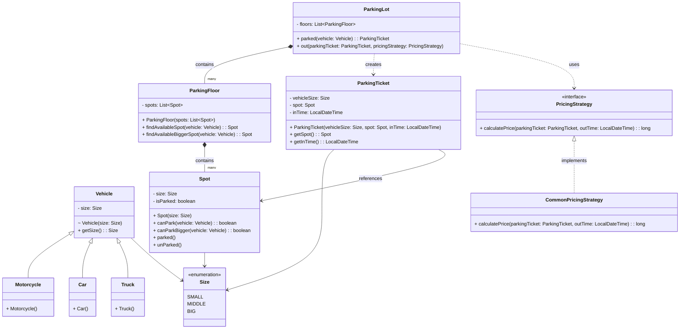

# 🚗 객체 지향 주차장 시스템 (OOD Parking Lot System)

## 1. 문제 사이트
* [https://codemia.io/object-oriented-design/design-a-parking-lot]

## 2. 프로젝트 목적
객체지향 설계의 기본기를 다지기 위한 순수 자바 도메인 설계 문제 프로젝트입니다. 각 클래스마다 역할과 책임을 분배해 객제치향적인 설계를 구축하는 것을 목표로 했습니다.

### 2-1. 문제 요구사항
**기능적 요구사항 (Functional Requirements):**

- 차량 크기에 따라 주차 공간을 할당합니다. 오토바이는 소형(small) 공간에, 자동차는 중형(medium) 공간에, 트럭은 대형(large) 공간에 주차할 수 있으며, 필요한 경우 더 큰 공간에도 주차할 수 있도록 허용해야 합니다.
- 차량 진입 시 주차권(ParkingTicket)을 발급하며, 여기에는 차량 정보, 할당된 주차 공간, 진입 시간(timestamp)이 기록되어야 합니다.
- 차량 출차 시 머문 시간과 설정 가능한 요금 정책(pricing strategy)을 기반으로 주차 요금을 계산합니다.
- 주차장이 만차인 상황을 처리해야 합니다. 진입을 거부하고 운전자에게 '만차(lot-full)' 표시를 안내해야 합니다.
- 주차장은 여러 층(multiple floors)을 지원해야 하며, 각 층은 소형, 중형, 대형 주차 공간이 섞여 있어야 합니다.

**비기능적 요구사항 (Non-Functional Requirements):**

- 핵심 비기능적 요구사항들을 나열하세요 (예: 스레드 안전성(thread safety), 확장성(extensibility), 유지보수성(maintainability) 등).

### 2-2. 요구사항 분석
### 1. `ParkingLot` (주차장 클래스)

- 생성자
    - 싱글턴으로 구현
- **필드**
    - `List<ParkingFloor>`: 주차 층에 대한 리스트.
- **메서드**
    - `isFull(ParkingSpace parkingSpace)`: `ParkingSpace` 클래스 안에 있는 `checkSpace()` 메서드를 호출해 주차 공간이 만차인지 아닌지 반환받는 메서드.
    - `Parked()`: 입차 시 `ParkingTicket` 객체를 반환해 주는 메서드. 티켓의 생성자를 호출할 때 인수로 `vehicle`, `spot`, `LocalDateTime.now()`를 넘겨주고, 호출한 사용자에게 티켓을 줌.
    - `out()`: 출차 메서드. 출차 시간을 요금 정책 클래스에게 넘겨주고, 요금 정책의 책임을 수행하게끔 금액을 확인하는 메서드를 호출.

### 2. `ParkingFloor` (주차 층 클래스)

- **관계:** `ParkingLot` 클래스 안에 포함됨 (포함 관계).
- **필드**
    - `List<Spot>`: 층 안에 있는 주차 공간에 대한 클래스의 집합 리스트.
- **메서드**
    - `findAvailableSpot(Vehicle vehicle)`: 차량의 크기 정보를 확인하고, 리스트 안의 스팟 중 차량 크기와 일치하는 공간의 `isEmpty()` 메서드를 우선 수행. 만약 해당 메서드가 `false`일 시, 다음 단계 크기에 대한 `isEmpty()`를 수행하며 주차 가능 여부에 대해 판단.

### 3. `Spot` (소, 중, 대형 공간 클래스)

- **관계:** `ParkingFloor` 클래스 안에 포함됨 (포함 관계).
- **필드**
    - `size`: 공간의 크기에 대한 사이즈(`small`, `middle`, `big`) 값.
        - *설계 의도:* 상위 클래스로 두고 각 사이즈마다 상속받게 하지 않은 이유는, 하위 클래스로 나누더라도 요구사항을 보면 따로 나눠서 쓸 이유가 없다고 판단했기 때문. **ENUM 클래스로 값의 오남용 방지**.
    - `empty`: 해당 공간이 비었는지 확인하는 상태 값.
- **메서드**
    - `isEmpty()`: 해당 공간이 찼는지(비어있는지) 확인하는 메서드.

### 4. `ParkingTicket` (주차권 클래스)

- **필드**
    - 차량 정보, 할당된 주차 공간, 진입 시간.
- **메서드**
    - `티켓 발급 메서드`: 진입 시간은 주차권 클래스 본인이 상태를 변경해야 함 (`now()` 등의 메서드로 정보를 적고 반환).

### 5. `PricingStrategy` (요금 계산 클래스)

- **특징:** 좀 더 유지보수를 좋게 하려면 인터페이스화해도 될 듯함.
- **메서드**
    - `pay()`: 주차장의 `out()` 메서드로부터 전달받은 정보로 금액을 계산한 뒤 반환.

### 6. `Vehicle` 및 하위 클래스 (차량 클래스)

- **`Vehicle`**: 오토바이, 자동차, 트럭의 조상이 되는 상위 클래스. 내부에 멤버 변수로 차량 크기를 가지고 있음.
- **`Motorcycle`**: `Vehicle` 클래스를 상속받는 오토바이 클래스.
- **`Car`**: `Vehicle` 클래스를 상속받는 자동차 클래스.
- **`Truck`**: `Vehicle` 클래스를 상속받는 트럭 클래스.
--------
## 3. UML


## 4. 폴더 구조
```text
parking-lot-system/
├── src/
│   └── main/
│       └── java/
│           └── com/parkinglot/
│               ├── domain/
│               │   ├── vehicle/
│               │   │   ├── Size.java
│               │   │   ├── Vehicle.java
│               │   │   ├── Car.java
│               │   │   ├── Motorcycle.java
│               │   │   └── Truck.java
│               │   ├── space/
│               │   │   ├── Spot.java
│               │   │   ├── ParkingFloor.java
│               │   │   └── ParkingLot.java
│               │   └── ticket/
│               │       └── ParkingTicket.java
│               ├── policy/
│               │   ├── PricingStrategy.java
│               │   └── CommonPricingStrategy.java
│               └── Application.java

```


## 5. 고민했던 로직 및 해결 방법

### 5-1. 예외 처리를 비즈니스 흐름 제어에 사용하던 문제

**문제 상황:** 초기에는 만차 상황을 처리할 때 `NullPointerException`을 활용해 예외를 던지고 try-catch문으로 예외를 잡으며 해결하려 했습니다. 하지만 단순히 공간이 null때만 처리하는 단순한 작업이기 때문에 예외 생성과 스택 추적을 사용하며 해당 예외를 처리하기엔 너무 비효율적이라 생각했습니다.
**해결 방법:** 만차는 시스템 에러가 아닌 충분히 해결 가능한 비즈니스 상황입니다. 무거운 예외 처리 대신 조건문과 빠른 반환(Early Return)을 적용해 성능을 최적화하고 가독성을 높였습니다. 불필요한 `else` 블록을 제거해 코드 흐름을 일직선으로 만들었습니다.

```java
// 개선된 ParkingLot.java 로직
public ParkingTicket parked(Vehicle vehicle) {
    for (ParkingFloor floor : floors) {
        // 1. 딱 맞는 자리 탐색
        Spot spot = floor.findAvailableSpot(vehicle);
        if(spot != null) {
            return new ParkingTicket(vehicle.getSize() spot LocalDateTime.now());
        }

        // 2. 더 큰 자리 탐색
        spot = floor.findAvailableBiggerSpot(vehicle);
        if(spot != null) {
            return new ParkingTicket(vehicle.getSize() spot LocalDateTime.now());
        }
    }
    System.out.println("만차입니다.");
    return null;
}

```

### 5-2. CQS(명령과 조회의 분리) 원칙 위배

**문제 상황:** 초기 `Spot` 객체에서 주차 가능 여부를 묻는 `canPark()` 메서드 내부에 `isParked = true` 상태 변경 로직을 섞어 조회와 상태 변경을 한 번에 실행하려 했습니다. 이로 인해 단순 조회를 목적으로 호출해도 자리가 차버리는 부수 효과(Side Effect)가 존재했습니다.
**해결 방법:** 상태를 묻는 질문과 상태를 변경하는 명령을 완벽하게 분리하여 언제 호출해도 안전한 메서드로 리팩토링했습니다.

```java
// 개선된 Spot.java 로직
public boolean canPark(Vehicle vehicle) {
    // 단순 조회(Query) 역할만 수행
    if(vehicle.getSize().ordinal() == size.ordinal() && isParked == false) {
        return true;
    } else {
        return false;
    }
}

// 상태 변경(Command) 명시적 분리
public void parked() {
    isParked = true;
}

```

### 5-3. 탐욕적 탐색으로 인한 공간 낭비

**문제 상황:** Enum의 `ordinal()`을 활용해 대소 비교를 구현한 후 리스트를 순회할 때 오토바이가 텅 빈 대형 화물차 자리를 무작정 선점해버리는 공간 비효율 문제가 발생했습니다.
**해결 방법:** 차량 크기와 정확히 일치하는 자리를 먼저 찾아보고 자리가 없을 경우에만 더 큰 자리를 찾는 2단계 우선순위 탐색(Fall-back) 로직을 층(Floor) 객체 내부에 분리해 구현했습니다.

```java
// 개선된 ParkingFloor.java 로직
public Spot findAvailableSpot(Vehicle vehicle) {
    for (Spot spot : spots) {
        if(spot.canPark(vehicle)) {
            spot.parked();
            return spot;
        }
    }
    return null;
}

public Spot findAvailableBiggerSpot(Vehicle vehicle) {
    for (Spot spot : spots) {
        if (spot.canParkBigger(vehicle)) {
            spot.parked();
            return spot;
        }
    }
    return null;
}

```

### 5-4. 요금 정책의 확장성 문제

**문제 상황:** 요구사항에 구체적인 요금 산정 공식이 없었습니다. 이를 도메인 내부에 하드코딩하면 새로운 요금제 추가 시 핵심 코드를 직접 수정해야 하는 OCP(개방-폐쇄 원칙) 위배 문제가 우려되었습니다.
**해결 방법:** `PricingStrategy` 인터페이스를 도입해 전략 패턴(Strategy Pattern)을 적용했습니다. 외부에서 주차권과 현재 시간을 넘겨받아 정책을 수행하도록 설계해 무한한 확장이 가능하도록 구축했습니다.

```java
// 전략 패턴이 적용된 CommonPricingStrategy.java
public class CommonPricingStrategy implements PricingStrategy{
    @Override
    public long calculatePrice(ParkingTicket parkingTicket LocalDateTime outTime) {
        long minutes = ChronoUnit.MINUTES.between(parkingTicket.getInTime() outTime);
        return minutes * 100;
    }
}

```

## 6. 회고
```
** 2026-06-12
공부를 시작한 이래 처음으로 흥미를 느끼며 혼자 객체지향적인 설계를 해보려고 고민을 많이 했습니다. 제가 추구하는 이상적인 객체지향 설계는 목표 -> 협력 -> 역할 -> 책임이 완전히 분리된 설계를 하는 것이였습니다. 처음 이런 설계 문제를 접해보니 구현에 대한 어려움이 많이 느껴졌습니다.

초기에는 요구사항 분석 -> 코드 구현 순서로 진행하였는데 진행을 하는 도중 UML이 없다 보니 어떤 클래스에 어떤 필드와 메서드가 필요한지 중간중간 헷갈리는 경우가 생겼습니다. 다음 프로젝트부터는 UML을 먼저 작업하는 순서로 진행할 것 같습니다.

객체지향의 사실과 오해 책을 읽고 흥미가 생겨 접근한 문제인데 책의 원칙을 지키며 코드를 구현하려니 생각보다 막히는 부분이 있었습니다. getter()로 객체의 상태를 가져와 사용하지 않고 메시지와 메서드로 객체의 상태 판단을 요구하려 하였으나 차의 크기 같은 단순한 상태 값을 이런 방향으로 구현하면 갓 클래스와 같은 형태가 될 것 같았습니다.

상태의 변경이 아닌 단순한 상태의 조회 같은 경우는 getter()를 써서 직접 조회를 하는 것이 더 올바른 방향이라 생각이 들었습니다.

그리고 항상 예외 처리는 try-catch문으로 처리한다라는 생각이 뇌리에 박혀있었는데 해결 가능한 단순한 에외의 경우는 if문으로 처리하는 것이 더 효율적이라는 것을 알았습니다.

프로젝트를 진행하며 얻은 꺠달음으로 좀 더 객체지향적인 설계에 도전할 수 있을 거 같습니다.

기회가 된다면 해당 프로젝트를 계속 리팩토링하며 객체지향적인 완전한 주자장 시스템을 구축하겠습니다.

해당 저서를 읽으며 느낀 객체지향에 대한 생각을 정리한 글입니다.
[https://view45690.tistory.com/6]
```
